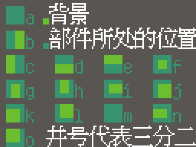

# 部件要求
部件必须是12×12像素的PNG文件，且在右、上边留白，如图所示。  
  
颜色必须为透明（`#00000000`）底黑（`#000000FF`）色。
# 命名法
> TODO: 命名法半重写

本项目中单个汉字由两个部件组成，格式为“Unicode 代码点 + 部件所处位置 + 子部件编号”。
## Unicode 代码点
Unicode 代码转成 16 进制后，在字符和字符的分割处加点。
## 部件所处位置
部件所处的位置可以看这张图。  
  
> **对于 `⿲`、`⿳` 的处理:**  
> `⿲abc` 或 `⿳abc` 会看作 `⿰a⿰bc` 或 `⿱a⿱bc`，`⿱bc` 部分所对应的部件在所处位置后会加一个 `#` 号。